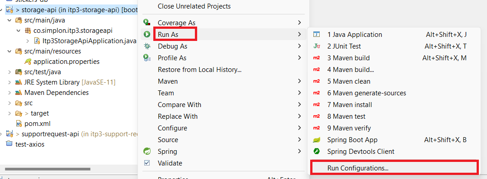
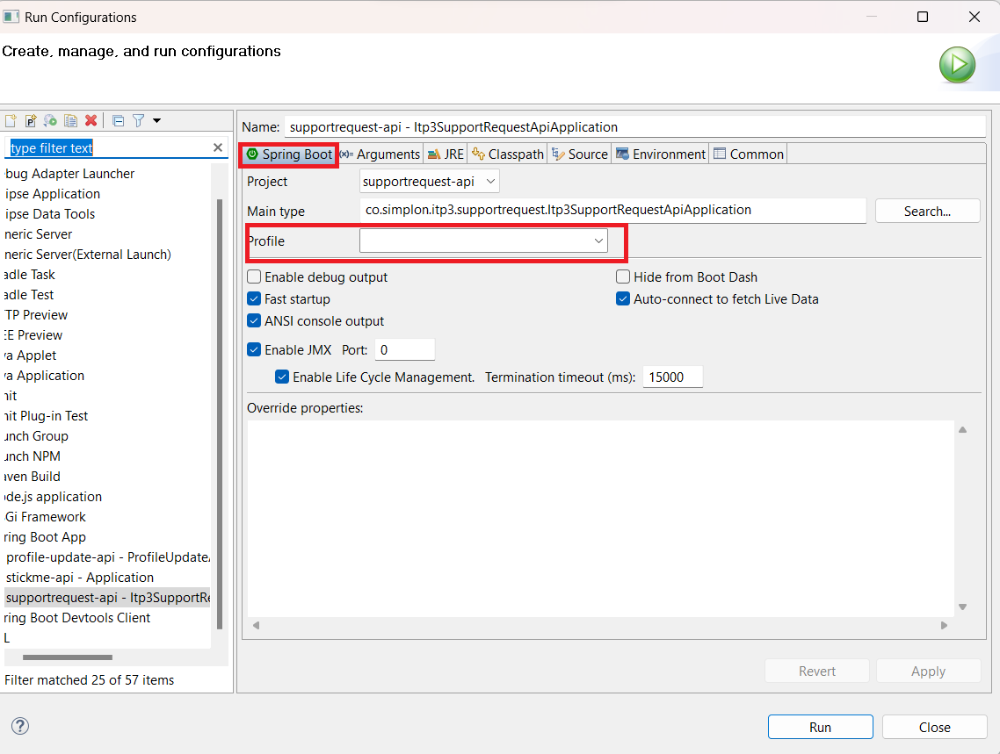

# Spring Profiles and Properties

## What is a Spring Profile?

Spring Profile map **beans** \* to different profiles (dev, test, prod for example).

- Beans are objects that are instanciated, assembled and handled by Spring IoC Containers (IoC stands for Inversion of Control). When these objects are created, Spring injects the beans in order to create the dependences between each other.

- ([source](<[https://docs.spring.io/spring-boot/docs/1.2.0.M1/reference/html/boot-features-profiles.html#boot-features-profiles](https://www.baeldung.com/spring-profiles)>))

### To use Spring Profiles

Use **@Profile** annotation.

Examples:

@Profile("dev") => the bean will only be instanciated with the dev profile.
@Profile("!dev") => the bean will be instanciated with all profiles except dev.

([source](https://www.baeldung.com/spring-profiles))

## Is there a default profile?

Yes.

Any bean that does not specify a profile belongs to the default profile.

Spring also provides a way to set the default profile when no other profile is active — by using the spring.profiles.default property.

Therefore we can define a default profile by ourselves.

([source](https://www.baeldung.com/spring-profiles))

## How to specify a profile when running an app from command line?

In the case we want to use the dev profile, specify on the command line using the switch `--spring.profiles.active=dev`

([source](https://docs.spring.io/spring-boot/docs/1.2.0.M1/reference/html/boot-features-profiles.html#boot-features-profiles))

## How to specify a profile when running from IDE? Run configurations

In Eclipse, right click on your project.

- Select "run as..."
- "Run configuration"

- In the "Spring profile" part of this window, select the desired profile in "Profile".

- 

## Can we "mix" profiles, e.g. default + production?

We can't mix profiles but we can use different properties files with a same profile (for instance use some properties from a default application.properties and some properties from a properties file made for the specific environment, such as application-dev.properties).

## Can we have multiple properties files?

Yes. For instance we can have a properties file for the dev environment and for the prod environment.

## Can we use variables in properties files?

You can use variables in your application.properties file.
For example, you can to add custom properties to JWT token in your file properties, containing :

# Properties

nb : Indicate in which property file the property should be used

N = NORMAL D = DEV // P = PROD // S = Secret

`spring.application.name=<app_name>` N

a`pp_name.env=<env_or_prod>` N

used to indicate or set the environment in which the application will be running

## Server Configuration

`server.port=8080`

Specifies the port on which the embedded web server will listen for incoming requests. N

## Database Configuration

`spring.datasource.url=jdbc:postgresql://localhost:5432/<DATABASE_NAME>` D, P

`spring.datasource.username=<USERNAME>` S

`spring.datasource.password=<PASSWORD>` S

## Logging Configuration

`logging.level.root=<Log_Level>` D, P

sets the root log level

`logging.pattern.console<Log_pattern>`

used to define the format of log messages that are displayed in the console

OFF => No logging

FATAL => (or CRITICAL) The most severe log level. Reserved for critical errors that lead to application failure or shutdown.

ERROR => Represents errors in the application that do not prevent it from functioning

WARN => Indicates potentially problematic situations that are not errors but might require attention.

INFO => Used to convey important, normal runtime information

DEBUG => Messages that provide information for debugging purposes.

TRACE => The most detailed log level.

`logging.file.name=app_name/logs/` P

Used to configure the name and location of the log file

`logging.logback.rollingpolicy.max-file-size=27KB` P

Configure the maximum size of log files

`logging.logback.rollingpolicy.total-size-cap=270KB` P

Total size of all log files under a specified number

`logging.logback.rollingpolicy.max-history=7` P

Indicates that you want to keep a history of log files for the last 7 rotations.

### Java Persistence API (JPA) is used for interacting with databases in Java applications.

`spring.jpa.show-sql=true` D

Hibernate will log the SQL statements in the application's log output. (true dev & false prod)

`spring.jpa.properties.hibernate.format_sql=true` D

This property controls whether the SQL statements logged by Hibernate should be formatted

## Files Configuration

`spring.servlet.multipart.location=<SOME_PATH>` D, P

This configuration specifies the location where uploaded files will be temporarily stored on the server before they are processed.

`copyme.uploads.location=<SOME_PATH>` N

final location

`spring.servlet.multipart.max-file-size=2MB` N

Sets the maximum allowed size for an individual uploaded file

## API GateWay Configuration

`spring.cloud.gateway.routes[0].id=<APP_ID>`

sets the ID for the first route

`spring.cloud.gateway.routes[0].uri=<MicroS_URI>`

This defines the target URI (Uniform Resource Identifier) for the route. Incoming requests that match the specified predicates will be forwarded to this URI.

`spring.cloud.gateway.routes[0].predicates[0]=Path=/predicate-example/**`

Predicates define the conditions under which a route should be executed. Here, the route will be executed if the incoming request path matches /predicate-example/

`spring.cloud.gateway.routes[0].filters[0]=StripPrefix=1`

Filters allow you to modify the request or response before or after routing. The StripPrefix=1 filter is applied to this route. It means that the first segment of the path is removed before the request is forwarded.
/example-predicate/resource, after applying this filter, it will become /resource.

## CORS Configuration (api gateway)

`spring.cloud.gateway.globalcors.cors-configurations.[/**].allowed-origins=http://localhost:5173/` D, P

This property specifies the allowed origins for cross-origin requests.

`spring.cloud.gateway.globalcors.cors-configurations.[/**].allowed-methods=GET,POST,PUT,DELETE` N

specifies the allowed HTTP methods for cross-origin requests.

`spring.cloud.gateway.globalcors.cors-configurations.[/**].allowed-headers=\*` N

specifies the allowed headers for cross-origin requests.

`spring.cloud.gateway.globalcors.cors-configurations.[/**].allow-credentials=false` N

specifies whether credentials (such as cookies or HTTP authentication) are allowed to be included in cross-origin requests.
